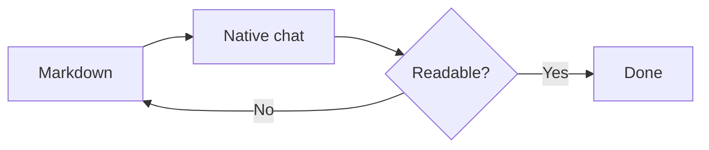
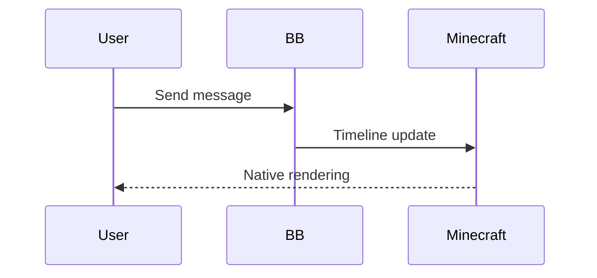

# Native rich chat

Readable **bold**, *italic*, ***both***, ~~removed~~, and `inline code` with Unicode: café, 日本語, 😀.

This paragraph has a [web link](https://example.com/a?b=1&c=2), https://example.com/autolink and a [file with spaces](<src/main/java/toomanyagents/ui/AgentChatScreen.java:12>).

> A quote with **emphasis**.
>
> - A nested list
> - Another item

1. First item
2. A longer second item that should wrap without losing its indentation or skipping any copied characters.
   - Nested bullet
   - [x] Completed task
   - [ ] Open task

---

## Code and whitespace

```java
public class Example {
    // A very long line that must remain intact and scroll horizontally: abcdefghijklmnopqrstuvwxyz 0123456789 abcdefghijklmnopqrstuvwxyz 0123456789 abcdefghijklmnopqrstuvwxyz
    String literal = "**not bold**, [not a link](https://example.com), <tag>";

	void tabbed() { System.out.println("café 😀"); }
}
```

````text
This fence contains a shorter fence:
```java
still literal
```
````

    indented code
        with four more spaces

## Tables

| Left | Center | Right | A wide fourth column |
| :--- | :---: | ---: | --- |
| **Bold** | `code` | 123.45 | Long content that wraps inside its cell, while other cells stay aligned. |
| Escaped \| pipe | [link](https://example.com) | -1 | 日本語 😀 |
| empty below | | | |

## Images


## Mermaid





## Literal and malformed input

<script>alert('display as text')</script>

[unsafe](javascript:alert%281%29) [command](run_command:/op) [bad](https://)

Unfinished **bold and [link](https://example.com

```unfinished
Streaming fence without a closing delimiter
